https://share.gemini.google/JrGKZJYorKog# O.C.E.A.N.
## Offshore Culprit Evaluation & Attribution Network

**Product Requirements Document**

**Smart India Hackathon 2026**
**Problem Statement ID:** 26143
**Problem Statement Title:** Leveraging satellite imagery to determine oil spills at sea along with AIS data correlations to identify the vessel responsible for the spill.
**Organization / Department:** National Technical Research Organisation (NTRO)
**Category:** Software | **Theme:** Disaster Management

Alternative internal working names considered: EcoTrace, HydroTrace, BlueSentinel, SlickSense, MarineVigil. **O.C.E.A.N.** is used as the primary name throughout this document.

---

### Document Control

| Field | Value |
|---|---|
| Document Title | O.C.E.A.N. — Product Requirements Document |
| Version | 1.0 (Draft for SIH submission) |
| Date | 06 September 2026 |
| Author | Team [TBD], SIH 2026 |
| Status | Draft — Implementation Ready |
| Classification | Internal / Hackathon Use |

**Revision History**

| Version | Date | Change | Author |
|---|---|---|---|
| 0.1 | — | Initial outline from problem statement | Team |
| 1.0 | 06-Sep-2026 | Full technical PRD | Team |

---

### How to Read This Document

Throughout this PRD, every capability is tagged with one of four scope labels so that assumptions are never silently presented as facts:

- **[OFFICIAL]** — Explicitly stated in the SIH problem statement (PS ID 26143).
- **[PROPOSED]** — Our system's proposed approach to satisfy an official requirement; an engineering decision, not a mandate.
- **[ASSUMPTION]** — A technical assumption made because real-world data/access may not exist during the hackathon window.
- **[EXPERIMENTAL]** — A technique that is scientifically plausible but requires empirical validation before being trusted; never to be presented as a guaranteed capability.

Scope tags used for delivery planning:
**[MVP]** hackathon deliverable · **[ADV]** advanced/near-term extension · **[PROD]** production/government-deployment scope · **[RESEARCH]** needs further scientific validation.

---

## Table of Contents

1. Executive Summary
2. Problem Definition
3. Official SIH Requirements vs. Proposed System Requirements
4. Product Vision & Guiding Principles
5. Personas
6. User Journeys
7. End-to-End System Workflow
8. Data Sources
9. Data Ingestion Architecture
10. Satellite Oil-Spill Detection
11. Look-Alike Discrimination
12. Natural Oil Seep Handling
13. Weather-Induced Look-Alike Filtering
14. Optical Imagery, Sun Glint & Cloud Handling
15. Multiple / Merged Spill Handling
16. Subsurface & Weathered Oil Limitations
17. Spill Characterization
18. Oil Weathering Modelling
19. Hydrodynamic Hindcasting Engine
20. Monte Carlo Origin Estimation
21. Temporal Latency & Confidence Decay
22. Coastal Hydrodynamics
23. AIS Data Model
24. AIS Spatial & Temporal Correlation
25. Dark Vessel / AIS Gap Detection
26. AIS Spoofing & Integrity Scoring
27. Congested Shipping Lanes
28. Ship-to-Ship Transfer Detection
29. Stationary Source Attribution
30. Vessel Suspicion Index (VSI)
31. Evidence Fusion & Explainability
32. Confidence vs. Suspicion Framework
33. Dashboard & Command Interface
34. Interactive Map Design
35. End-to-End User Flow
36. Evidence Dossier Generation
37. Alerting Framework
38. Backend Architecture
39. Database Design
40. PostGIS Spatial Design
41. API Specification
42. Asynchronous Processing
43. Security Architecture
44. Model & Data Integrity
45. ML Model Management
46. Model Evaluation Metrics
47. Ground Truth Strategy
48. Synthetic Data Strategy
49. SIH Demo Scenario
50. Edge Case Matrix
51. Risk Register
52. Non-Functional Requirements
53. Observability
54. Auditability
55. Explainability Framework
56. Human-in-the-Loop Design
57. Feedback Loop
58. MVP Scope
59. Advanced / Future Scope
60. Implementation Roadmap
61. Team Role Distribution
62. Testing Strategy
63. Acceptance Criteria
64. Success Metrics
65. Competitive Differentiation
66. Innovation Summary
67. Research Foundation
68. Technology Stack
69. System Architecture Diagrams
70. Sequence Diagram
71. Case State Machine
72. Data Quality Framework
73. Uncertainty Framework
74. Legal & Ethical Considerations
75. Deployment Architecture
76. Storage Architecture
77. Failure Handling
78. Requirement ID Register
79. User Stories
80. Product Backlog
81. Traceability Matrix
82. Demo Readiness Checklist
83. Final System Summary

---

## 1. Executive Summary

Marine oil spills cause severe and often irreversible ecological damage, disrupt fisheries and coastal livelihoods, and impose major cleanup and legal costs on the state. A persistent enforcement gap exists: satellite remote sensing can reveal *that* a spill occurred, but rarely reveals *who* caused it. Vessels responsible for illegal discharges routinely go unidentified because (a) satellite revisit intervals mean the slick is observed hours to days after release, (b) ocean currents and wind displace the slick far from the true origin by the time it is imaged, and (c) AIS vessel-traffic data is voluminous, sometimes incomplete, and not natively correlated with satellite detections.

**O.C.E.A.N. (Offshore Culprit Evaluation & Attribution Network)** is a proposed [PROPOSED] AI-assisted maritime intelligence platform that closes this gap by chaining together five capabilities that are traditionally operated in isolation:

1. **Satellite-based oil-slick detection** (Synthetic Aperture Radar, optically supplemented) with explicit look-alike discrimination.
2. **Physically grounded hindcasting** of the slick's drift, using ocean current and wind forcing to estimate a *probabilistic* origin region and time window rather than a single point.
3. **AIS-based vessel correlation**, filtering tens of thousands of AIS records down to a short, ranked list of plausible source vessels using spatio-temporal and behavioural evidence.
4. **Explainable suspicion scoring** (the Vessel Suspicion Index, VSI) that shows *why* a vessel is ranked highly, broken into named evidence components rather than a single opaque probability.
5. **Human-in-the-loop investigation tooling** — a command dashboard and an auto-generated evidence dossier — that keeps a trained analyst in control of every enforcement decision.

The system deliberately avoids overclaiming. It never asserts vessel guilt. Every output is expressed as a ranked, probabilistic, evidence-backed candidate requiring human verification — a design constraint discussed at length in Section 74 (Legal & Ethical Considerations) and enforced throughout the scoring framework (Sections 30–32).

**Why this differs from a simple oil-spill detector.** Numerous published and prototype systems detect dark patches in SAR imagery. Very few systems close the loop from *detection* to *attribution*. O.C.E.A.N.'s core contribution is the orchestration layer that fuses:

```
SATELLITE EVIDENCE + OCEANOGRAPHIC PHYSICS + METEOROLOGY + AIS + VESSEL BEHAVIOUR
+ GEOSPATIAL ANALYTICS + HUMAN VERIFICATION
```
into one operational, auditable, end-to-end workflow: **DETECT → VALIDATE → CHARACTERIZE → HINDCAST → FORECAST → CORRELATE AIS → RANK SUSPECTS → GENERATE EVIDENCE → SUPPORT RESPONSE.**

**Primary users** are maritime surveillance/intelligence officers, Coast Guard command staff, and port-state control officers, supported by field patrol units, environmental monitoring authorities, and system analysts (Section 5).

**Expected impact.** For the hackathon, O.C.E.A.N. demonstrates — on a historical/synthetic case — that a spill's satellite signature can be traced through physics-based hindcasting to a small, explainable set of ranked candidate vessels, with a generated evidence report suitable for human review. In a production government context (Section 59, 75–77), the same architecture can operate continuously on live Sentinel data and licensed AIS feeds to support NTRO and Coast Guard enforcement operations.

---

## 2. Problem Definition

### 2.1 The Marine Oil Spill Problem
Oil spills at sea originate from tanker discharges (legal ballast/bilge or illegal dumping), collisions, groundings, pipeline and platform leaks, and natural seeps. Illegal operational discharges — deliberate releases during transit to avoid port reception-facility costs — are the hardest category to police because they are brief, mobile, and rarely witnessed directly.

### 2.2 Environmental Impact
Oil slicks damage pelagic and benthic ecosystems, coat seabirds and marine mammals, contaminate fisheries, and can persist in sediments for years. Even non-catastrophic operational discharges, if frequent, accumulate significant cumulative ecological harm.

### 2.3 Economic Impact
Impacts include fisheries closures, tourism loss, cleanup costs, port disruption, and — where a responsible party is identified — litigation and compensation claims under domestic and international liability regimes (e.g., MARPOL Annex I).

### 2.4 Difficulty of Identifying Responsible Vessels
By the time a slick is observed via satellite, the responsible vessel may be tens of nautical miles away, may have altered course, or may have briefly disabled its AIS transponder. Without a systematic method to work backward from the observed slick to a time-and-place window, and forward from AIS history to a short vessel list, attribution is effectively guesswork.

### 2.5 Limitations of Satellite-Only Detection
Satellite SAR/optical imagery shows *that* a dark surface anomaly exists, not *who* produced it. It cannot resolve vessel identity on its own, and cannot by itself distinguish oil from many other dark-surface phenomena (Section 11).

### 2.6 Limitations of AIS-Only Analysis
AIS shows *where vessels claim to be*, not *what they discharged*. AIS traffic in busy sea lanes is dense, and legitimate reasons exist for course changes, slow-downs, and even AIS gaps (VHF dead zones, terminal outages). AIS alone cannot confirm a spill occurred, nor pinpoint which of many nearby vessels is responsible.

### 2.7 Limitations of Simple Proximity Matching
Naively selecting "the nearest vessel to the slick at detection time" is unreliable: the slick has already drifted from its origin by the time it is imaged, so the nearest vessel *to the slick* is frequently innocent, while the vessel *actually responsible* may now be far away.

### 2.8 Why Ocean Currents and Wind Make Attribution Difficult
Surface currents (tidal, wind-driven, geostrophic) and direct wind drag/Stokes drift move oil at different rates and directions than they move vessels. Correct attribution therefore requires modelling the slick's transport *backward in time* under the actual environmental forcing at the time of release — not simple straight-line extrapolation.

### 2.9 Why Satellite Revisit Latency Matters
Sentinel-1 revisit over a given area is on the order of ~6–12 days for a single satellite (shorter with constellation tasking); even with tasking, hours typically elapse between release and image acquisition. This latency directly enlarges the plausible origin region and the AIS search window (Section 21).

### 2.10 Why AIS Can Be Incomplete or Manipulated
AIS coverage can be degraded by terrestrial receiver range, satellite-AIS latency, intentional transponder shutdown ("going dark"), and outright message spoofing. A system that assumes AIS is complete and honest will systematically miss the vessels most likely to be culpable (Sections 25–26).

### 2.11 Why False Positives Are a Major Problem in SAR-Based Detection
Low-wind zones, biogenic slicks (algae, fish oil), rain cells, current shear lines, and internal waves all produce SAR backscatter reductions that visually resemble oil ("look-alikes"). Published SAR oil-spill literature (e.g., Brekke & Solberg, 2005 — see Section 67) consistently identifies look-alike discrimination as the dominant source of detection error, not raw slick segmentation.

### 2.12 Why a Multi-Modal System Is Required
No single data source is sufficient. Robust attribution requires **fusing** satellite evidence, physical oceanographic/meteorological forcing, and AIS behavioural evidence, with explicit uncertainty carried through every stage — which is the central design premise of O.C.E.A.N.


---

## 3. Official SIH Requirements vs. Proposed System Requirements

### 3.A Official SIH Requirements [OFFICIAL]
Directly from Problem Statement 26143:
1. Detect and characterise oil spills from satellite (SAR/EO) imagery.
2. Calculate geometric properties (area, perimeter, shape) and estimate spill age, if feasible.
3. Use oceanographic and meteorological data to trace the slick backward to origin point/time.
4. Predict the future flow (forward drift) of the slick.
5. Correlate the estimated origin with historic AIS data to reconstruct vessel traffic around the origin window.
6. Filter irrelevant AIS traffic.
7. Score potential suspect vessels using proximity, trajectory, and behavioural anomalies.
8. Provide a suitable visual interface.
9. Data guidance provided by SIH: sample AIS from MarineCadastre.gov (`https://marinecadastre.gov/accessais/`), real AIS if available else synthetic AIS for the spill region, and the Zenodo Sentinel-1 SAR Oil Spill Dataset for imagery.

### 3.B Proposed System Requirements [PROPOSED]
O.C.E.A.N. satisfies the above via 8 major subsystems (Sections 10–37): Detection, Look-Alike Validation, Characterization, Hindcast/Forecast Engine, AIS Correlation Engine, Vessel Suspicion Scoring, Command Dashboard, and Evidence Reporting — connected by a modular-monolith backend (Section 38) with an auditable case-state machine (Section 71).

### 3.C Technical Assumptions [ASSUMPTION]
- Real-time licensed AIS feeds and live tasked Sentinel-1 acquisitions are not available during the hackathon; the MVP therefore operates on **historical Sentinel-1 scenes** (Zenodo dataset) and **synthetic AIS** generated to match the demo scenario's space-time window, exactly as the SIH dataset guidance permits.
- High-resolution local hydrodynamic model output (coastal-scale) is assumed unavailable; the MVP uses global/regional reanalysis products (Section 22) and explicitly widens uncertainty in coastal zones.
- Vessel static metadata (type, dimensions) is assumed available only for a subset of MMSIs; missing metadata is handled as a data-quality gap (Section 72), not silently defaulted.

### 3.D MVP / Hackathon Scope
See Section 58 for the full MVP feature list.

### 3.E Advanced / Production Scope
See Sections 59 and 75–77.

### 3.F Experimental / Research Features [EXPERIMENTAL]
Explicitly flagged wherever introduced: thermal/SST-based look-alike discrimination (Section 11), age/weathering-stage estimation (Sections 17–18), reverse hindcast inference via forward-simulation ensembles (Section 19), and learned vessel-anomaly models (Section 59). None of these are presented as validated production capabilities.

---

## 4. Product Vision & Guiding Principles

O.C.E.A.N. is an **intelligence layer** connecting satellite observation, ocean physics, vessel tracking, and enforcement — not a replacement for human judgment. The system is designed to answer four progressively deeper questions:

| # | Question | Subsystem |
|---|---|---|
| 1 | Is this actually an oil spill? | Detection + Look-Alike Validation (§10–16) |
| 2 | What are its characteristics and how is it moving? | Characterization + Weathering + Forecast (§17–18, §20) |
| 3 | Where and approximately when did it originate? | Hindcast + Monte Carlo Origin Estimation (§19–22) |
| 4 | Which vessel/source correlates most strongly with that origin? | AIS Correlation + VSI (§23–30) |

**Guiding principles:**
- **Probabilistic, not absolute.** The system never states "Vessel X is guilty." It states, e.g., *"Vessel X is the highest-ranked suspect based on available evidence; Attribution confidence: 87%; Evidence quality: High; Human verification required."*
- **Explainability over a single score.** Every ranking is decomposable into named evidence components (Section 31).
- **Uncertainty is carried, not collapsed.** Detection, characterization, hindcast, AIS, and attribution each retain their own confidence measure (Section 73) rather than being merged into one number.
- **Human-in-the-loop is mandatory**, not optional (Section 56).
- **Graceful degradation.** Missing or low-quality inputs reduce confidence and are surfaced to the analyst; they never silently produce a false "high confidence" result (Section 77).

---

## 5. Personas

### Primary Personas

**P1 — Maritime Surveillance / Intelligence Officer**
- *Responsibilities:* Continuous monitoring of maritime zones of interest; triage of incoming spill alerts.
- *Goals:* Rapidly distinguish real spills from false alarms; identify credible suspect vessels.
- *Pain points:* Alert fatigue from false positives; disconnected tools (imagery viewer, AIS viewer, weather portal are separate today).
- *Permissions:* View all cases, run hindcast/attribution, generate dossiers, cannot delete audit logs.
- *Dashboard needs:* Map-first overview, confidence indicators, one-click drill-down.
- *Key actions:* Acknowledge alert, open case, initiate hindcast, review suspects, escalate.

**P2 — Coast Guard Command Officer**
- *Responsibilities:* Authorizing interception/patrol tasking based on analyst recommendations.
- *Goals:* Decide, with defensible evidence, whether to dispatch assets.
- *Pain points:* Needs a concise, defensible evidence summary, not raw data.
- *Permissions:* View cases, approve/override classification, dispatch field units.
- *Dashboard needs:* Evidence dossier view, VSI breakdown, map with vessel tracks.
- *Key actions:* Approve/reject attribution, dispatch, escalate to legal/enforcement.

**P3 — Port Authority / Port State Control Officer**
- *Responsibilities:* Inspecting a suspect vessel when it next calls at a controlled port.
- *Goals:* Receive early warning and a portable evidence package before vessel arrival.
- *Pain points:* Historically receives attribution information too late or informally.
- *Permissions:* View dossiers for vessels flagged in their jurisdiction.
- *Dashboard needs:* Vessel-centric case history, arrival ETA cross-reference.
- *Key actions:* Record inspection outcome, request additional evidence.

### Secondary Personas

**P4 — Field Patrol / Interception Unit** — receives dispatch, navigates to target, performs physical verification, records ground truth (confirmed spill / natural seep / false alarm / unknown), sends observation back to HQ. Permissions limited to assigned cases; can attach photos/notes.

**P5 — Environmental Monitoring Officer** — tracks ecological impact of confirmed spills, cross-references natural seep database (Section 12), contributes seep-location ground truth.

**P6 — Disaster Management Authority** — consumes high-severity alerts for spill-response coordination (booms, dispersants), independent of attribution outcome.

**P7 — Analyst / Data Reviewer** — reviews model outputs, curates ground truth, manages the feedback-loop dataset (Section 57); has read/annotate access to model confidence internals.

**P8 — System Administrator** — manages users/roles, data source connections, model versions, and system health dashboards (Section 87); no case-decision permissions.

---

## 6. User Journeys

**Surveillance Officer Journey:**
`Login → Monitor maritime zone → Receive oil-spill alert → Open detection → Inspect satellite imagery → Inspect AI confidence → Review false-positive/look-alike checks → Start hindcast → Review origin probability map → Review estimated time window → Inspect vessel candidates → Compare vessel trajectories → Review VSI breakdown → Inspect supporting evidence → Generate evidence dossier → Escalate to Command`

**Field Officer Journey:**
`Receive dispatch alert → Open target case → View vessel's last-known/predicted position → Navigate/intercept → Perform physical verification → Upload photos/observations → Record outcome (Confirmed Spill / Natural Seep / False Alarm / Unknown) → Submit ground truth to HQ`

Both journeys terminate in the shared **Feedback Loop** (Section 57): ground truth flows back to improve segmentation thresholds, look-alike filters, and VSI calibration.


---

## 7. End-to-End System Workflow

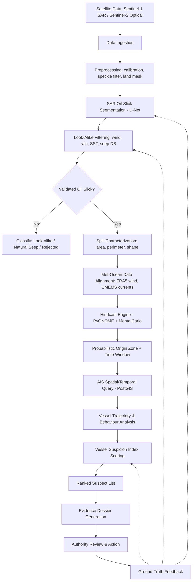

**Stage descriptions:**

| Stage | Input | Output | Section |
|---|---|---|---|
| Data Ingestion | Raw satellite scenes, AIS streams, met-ocean grids | Normalized, catalogued records | §9 |
| Preprocessing | Raw SAR scene | Calibrated, speckle-filtered, land-masked raster | §10.2 |
| Segmentation | Preprocessed raster | Binary mask + confidence map | §10.3 |
| Look-Alike Filtering | Mask + wind/SST/seep context | Validated slick / rejected candidate | §11–14 |
| Characterization | Validated polygon | Area, perimeter, shape descriptors | §17 |
| Met-Ocean Alignment | Polygon + timestamp | Time-matched current/wind fields | §9, §22 |
| Hindcast | Polygon + forcing fields | Particle ensemble, origin probability | §19–20 |
| AIS Query | Origin polygon + time window | Candidate vessel set | §24 |
| Behaviour Analysis | Candidate trajectories | Anomaly features | §25–29 |
| VSI Scoring | Anomaly features | Ranked suspects | §30 |
| Dossier | All above | PDF evidence report | §36 |
| Feedback | Field verification | Curated training data | §57 |

---

## 8. Data Sources

| # | Source | Type | Provides | Role |
|---|---|---|---|---|
| 1 | Sentinel-1 SAR (Copernicus) | Satellite (radar) | GRD/SLC imagery, day/night, weather-independent | Primary detection input |
| 2 | Sentinel-2 optical (Copernicus) | Satellite (optical) | True-colour imagery | Supplementary validation (cloud/sun-glint permitting) |
| 3 | Sentinel-3 SLSTR (SST) | Satellite (thermal) | Sea-surface temperature | [EXPERIMENTAL] discriminative feature |
| 4 | ECMWF ERA5 | Reanalysis | Wind fields, precipitation | Hindcast forcing, weather look-alike filter |
| 5 | Copernicus Marine Service (CMEMS) | Reanalysis/forecast | Ocean current vectors, SST, waves | Hindcast forcing |
| 6 | MarineCadastre.gov sample AIS [OFFICIAL] | Historical AIS | Vessel positions (US waters sample) | Demonstration / schema validation |
| 7 | Synthetic AIS [ASSUMPTION] | Generated | Vessel positions matching demo region | MVP fallback per SIH guidance |
| 8 | Zenodo Sentinel-1 SAR Oil Spill Dataset [OFFICIAL] | Labelled imagery | Oil/non-oil segmentation masks | Model training/evaluation |
| 9 | Known natural seep geodatabase | Curated/derived | Seep polygon locations | Natural-seep filter (§12) |

**Clarification of source types (avoiding conflation):**
- **Dataset** (Zenodo, MarineCadastre) = static/historical files used for training or demonstration — not a live feed.
- **Model** (U-Net segmentation, VSI scoring) = software trained/configured by this project.
- **API/Feed** (Copernicus Data Space, CMEMS API) = programmatic access to imagery/forcing data.
- **Physics engine** (PyGNOME) = a transport/fate *simulation engine*, not a dataset — it consumes forcing data and produces particle trajectories (§19).

---

## 9. Data Ingestion Architecture

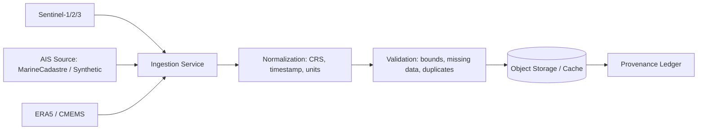

**Format handling:**
| Data class | Formats | Notes |
|---|---|---|
| Satellite raster | GeoTIFF, Cloud-Optimized GeoTIFF (COG) | COG preferred for partial/tiled reads |
| Ocean/atmosphere grids | NetCDF | CF-conventions; converted to arrays via xarray |
| AIS | CSV → Parquet (partitioned by day) | Parquet for efficient batch queries |
| Vector geometries | GeoJSON, PostGIS geometry | Spill polygons, seep zones, EEZ boundaries |

**Cross-cutting concerns:**
- **CRS handling:** All rasters reprojected to EPSG:4326 for storage metadata and EPSG:3857/UTM zone for area-preserving geometric calculations (§17).
- **Timestamp synchronization:** All records normalized to UTC; satellite acquisition time is the authoritative "T0-observed" reference for a case.
- **Missing-data handling:** Every ingestion record carries a `data_quality` flag (`COMPLETE`, `PARTIAL`, `MISSING`); downstream stages must consult this flag before consuming a field (§72).
- **Provenance:** Every derived artifact stores the source dataset ID, retrieval timestamp, and processing code/model version (§54, Auditability).


---

## 10. Satellite Oil-Spill Detection

### 10.1 Why Sentinel-1 SAR Is Primary
SAR is weather- and illumination-independent (works at night and through cloud), and oil films measurably dampen Bragg-scale capillary waves, producing a locally darker backscatter region relative to surrounding sea. This makes SAR the primary, robust detection sensor; optical imagery (Sentinel-2) is supplementary (§14).

### 10.2 SAR Preprocessing Pipeline
1. Radiometric calibration (digital number → sigma-nought backscatter).
2. Speckle filtering (e.g., Lee or refined Lee filter) to suppress multiplicative radar speckle without destroying slick edges.
3. Land/coast masking using a coastline vector layer, buffered to remove near-shore clutter.
4. Terrain correction / geocoding to a standard grid (range-Doppler terrain correction).
5. Normalization to a fixed dynamic range for model input.
6. Patch extraction (e.g., 256×256 or 512×512 tiles with overlap) for model inference on large scenes.

### 10.3 Semantic Segmentation Model
**Candidate architecture:** U-Net with a ResNet or EfficientNet encoder backbone (transfer-learned from ImageNet where feasible, fine-tuned on SAR).

**Why U-Net:** U-Net's encoder-decoder with skip connections preserves both global context (distinguishing sea from land/large weather features) and fine spatial detail (slick edges), and it is well established in the SAR oil-spill segmentation literature and in the referenced Zenodo dataset's typical baselines. It is also comparatively lightweight to train within a hackathon timeframe versus transformer-based segmenters.

**Model outputs per scene:**
- Binary spill mask (pixel-wise)
- Per-pixel/per-region confidence map
- Vectorized polygon(s) (mask → contour → simplified polygon)
- Bounding box, centroid, area, perimeter, and shape descriptors (§17)

**Training methodology:**
| Aspect | Approach |
|---|---|
| Split | Scene-level (not patch-level) train/validation/test split to avoid leakage between overlapping tiles of the same scene |
| Augmentation | Rotation, flip, contrast jitter (physically plausible for SAR); avoid augmentations that create unrealistic backscatter |
| Class imbalance | Oil pixels are a small minority; use weighted loss (e.g., weighted BCE + Dice) rather than plain cross-entropy |
| Evaluation | IoU, Dice coefficient, precision, recall, F1, false-positive rate per scene |

**Explicit limitation [EXPERIMENTAL→documented]:** No single model will perfectly separate oil from all look-alike phenomena from imagery alone; §11 describes the mandatory secondary validation layer. Detection confidence is always reported alongside the mask, never presented as certainty.

---

## 11. Look-Alike Discrimination

SAR "look-alikes" are non-oil phenomena that dampen backscatter similarly to oil films:
- Low-wind zones (below ~3 m/s, insufficient capillary wave generation regardless of oil presence)
- High-wind/rain cells (localized backscatter anomalies from precipitation)
- Biogenic slicks (algal blooms, fish oil, plankton exudates)
- Ship wake shadow zones
- Natural hydrocarbon seeps (§12)
- Current shear lines and internal waves

### 11.1 Validation Feature Set [PROPOSED / partly EXPERIMENTAL]
| Feature | Source | Status |
|---|---|---|
| Wind speed/direction at acquisition time | ERA5 | Proposed, standard |
| Precipitation flag | ERA5 | Proposed, standard |
| SST anomaly / thermal texture | Sentinel-3 SLSTR | **Experimental** — candidate discriminative feature requiring empirical validation, not a proven discriminator |
| Temporal persistence (does the anomaly recur across repeat passes?) | Multi-date SAR stack | Proposed |
| Spatial shape / texture (elongation, edge sharpness, fractal descriptors) | Segmentation output | Proposed |
| Polarization ratio (VV/VH) where dual-pol data available | Sentinel-1 | Proposed |
| Contextual proximity to shipping lanes / known seeps | Vector overlays | Proposed |

### 11.2 Multi-Modal Confidence Score [PROPOSED]

```
OilConfidence = w1*SARModelConfidence + w2*WindConsistency + w3*SSTFeature
                + w4*TemporalConsistency + w5*ShapeConsistency,   Σw_i = 1
```

Weights `w1..w5` are **configurable parameters**, tuned against labelled validation data; they are prototype defaults, not scientifically fixed constants. `SSTFeature`'s weight should default low until independently validated (see §11.1).

### 11.3 Output Classification
Every candidate detection resolves to one of: `VALIDATED_OIL_CANDIDATE`, `LOOK_ALIKE_REJECTED`, `NATURAL_SEEP_CANDIDATE` (§12), or `UNCERTAIN_REQUIRES_REVIEW`.

---

## 12. Natural Oil Seep Handling

O.C.E.A.N. maintains a geospatial database of known/suspected natural seep locations (from public geological surveys and cumulative satellite-derived seep observations).

**Workflow:**
1. Compute `spill_polygon ∩ seep_buffer` (buffered known-seep zones).
2. If intersecting, examine: recurrence frequency at that location across the historical SAR archive, persistence duration, and co-located AIS activity level.
3. Classify: `NATURAL_SEEP_CANDIDATE`, `LIKELY_ANTHROPOGENIC`, or `UNCERTAIN`.
4. Always route to human review before closing a case as a natural seep — the system proposes, the analyst confirms.

---

## 13. Weather-Induced Look-Alike Filtering

Wind and rain conditions at the acquisition timestamp are pulled from ERA5 and matched to the scene footprint and time. **Thresholds used to flag "insufficient wind for reliable detection" or "precipitation contamination" are configurable prototype values** — e.g., an initial low-wind threshold near 3 m/s and a high-wind threshold near 10–12 m/s — that must be calibrated against local validation data before being treated as operational cutoffs; they are not presented as universal physical constants.

---

## 14. Optical Imagery, Sun Glint & Cloud Handling

SAR remains the primary, robust detection source (§10.1). Optical imagery (Sentinel-2) is used only as **supplementary corroboration** when:
- Cloud cover over the AOI is low (quality flag from Sentinel-2 scene classification),
- Sun-glint geometry does not saturate the water surface (checked via solar/viewing geometry), and
- Acquisition time is reasonably close to the SAR detection.

If any of these checks fail, the system falls back to SAR-only evidence and reduces the "multi-sensor corroboration" component of overall detection confidence rather than blocking the case.

---

## 15. Multiple / Merged Spill Handling

Adjacent or overlapping discharges can appear in a single SAR scene as one connected dark region, which would bias a single-centroid hindcast. **[MVP: basic case only; ADV: full handling]**

Proposed advanced approach: connected-component analysis → morphological opening/closing to separate near-touching regions → distance-transform + watershed segmentation on the confidence surface → skeletonization to detect a "plume tail" indicating a linear drift history (which suggests a single elongated source rather than two independent spills) → where ambiguity remains, run **multi-hypothesis hindcasting** (separate Monte Carlo runs per candidate sub-region) rather than forcing a single origin estimate. Full multi-hypothesis hindcasting is flagged **[ADV]**; the MVP performs connected-component separation and treats each disjoint region as an independent case.

---

## 16. Subsurface & Weathered Oil — Explicit Limitations

**Important scientific caveat:** Sentinel-2/optical and Sentinel-1/SAR sensors detect **surface expressions** of oil. They cannot reliably detect fully submerged or dispersed subsurface hydrocarbons, and detection of heavily weathered (emulsified, sheened) oil is degraded compared to fresh slicks. Water clarity, sea state, and oil type all affect detectability. This is documented as an explicit **system limitation**, not solved by the MVP; a future enhancement path (e.g., incorporating fluorometry from in-situ sensors, or hyperspectral imagery) is noted under Advanced Scope (§59) rather than claimed as a current capability.


---

## 17. Spill Characterization

For every validated spill polygon, compute (in an equal-area projection, not raw lat/long):

| Metric | Method |
|---|---|
| Area | Polygon area in projected CRS (e.g., UTM zone of centroid) |
| Perimeter | Polygon boundary length |
| Centroid | Geometric centroid (lat/long) |
| Bounding box | Min/max lat/long envelope |
| Orientation | Principal axis angle (via PCA on boundary points) |
| Compactness | `4π·Area / Perimeter²` (1.0 = perfect circle) |
| Elongation | Ratio of major to minor axis length |
| Length / Width | Major/minor axis of best-fit ellipse |

**Age / weathering-stage estimation [EXPERIMENTAL]:** Approximate spill age can, in principle, be inferred from shape elongation (older slicks are more stretched by shear) and area growth relative to typical spreading rates, but this relationship is highly sensitive to sea state, oil type, and volume, and is **not a validated, general-purpose measurement**. O.C.E.A.N. reports an *age estimate range* with an explicit confidence band, and always frames it as a modelling estimate for investigative triage, not a forensic measurement.

---

## 18. Oil Weathering Modelling

Observed slick size is **not** equal to the originally released volume, because oil undergoes weathering:
- **Evaporation** — light fractions vaporize, especially in the first hours.
- **Spreading** — gravity/viscosity-driven areal spreading.
- **Emulsification** — water-in-oil emulsion formation ("chocolate mousse"), increasing apparent volume/viscosity.
- **Dissolution** — soluble fractions dissolve into the water column.
- **Dispersion** — wave action breaks the slick into droplets, some naturally dispersing subsurface.
- **Oxidation** — slow photochemical degradation.

Where feasible, O.C.E.A.N. uses **PyGNOME/ADIOS** oil-weathering algorithms to back-estimate a plausible original release volume range from the observed slick area/type and elapsed time, always expressed **probabilistically** (a distribution, not a single number), since reverse-weathering estimation carries substantial irreducible uncertainty.

---

## 19. Hydrodynamic Hindcasting Engine

**Engine:** NOAA's **PyGNOME** (General NOAA Operational Modeling Environment), a Lagrangian particle-transport and oil-fate simulation engine.

**Important clarification of scope:** PyGNOME is a *forward* particle-transport simulator — it moves particles forward through a current/wind field, applying weathering algorithms. It does **not** natively provide an exact "reverse simulation" that starts from an observed slick and produces a single deterministic origin. O.C.E.A.N.'s **orchestration layer**, built around PyGNOME, is what performs the inference:

1. Initialize a dense field of candidate particles across the observed slick polygon (representing "if this parcel of water/oil ended up here, where could it have started?").
2. Load historical current (CMEMS) and wind (ERA5) forcing fields for the plausible time window preceding the observation.
3. Run PyGNOME **forward-in-time** simulations from many candidate start locations/times sampled backward from the observation time, and retain those whose forward-simulated end state is consistent with the observed slick position, shape, and area (an inference-by-forward-simulation approach, since this avoids relying on an unvalidated literal time-reversal of a diffusive/stochastic transport model).
4. Aggregate the retained candidate start locations into a probability surface (§20).

This design explicitly separates **PyGNOME's native capability** (forward transport + weathering physics) from **O.C.E.A.N.'s own inference logic** (the ensemble-and-filter approach used to approximate a hindcast), so that no capability is falsely attributed to the underlying engine.

---

## 20. Monte Carlo Origin Estimation

Rather than a single origin coordinate, O.C.E.A.N. produces a **probability distribution** over candidate origin locations and times.

**Inputs varied across the ensemble:**
- Detected slick polygon (with its own segmentation-boundary uncertainty)
- Current-field uncertainty (ensemble members / reanalysis error bounds where available)
- Wind-field uncertainty
- Diffusion/turbulent-dispersion coefficient (varied within a physically reasonable range)
- Release-time uncertainty (candidate T0 sampled across the plausible pre-observation window)
- Weathering-model parameter uncertainty

**Procedure:** Run N stochastic forward simulations (N configurable; e.g., 500–2,000 for MVP performance) per candidate start-time/location; retain runs whose simulated end-state matches the observed polygon within a tolerance; accumulate retained start points into a 2D kernel-density surface.

**Outputs:**
- Origin probability heatmap (raster)
- 50%, 75%, and 95% confidence regions (isodensity contours)
- A single "most probable origin polygon" (the 50% region), always shown alongside the wider bands — never as if it were a precise point
- Estimated release time window (e.g., "most likely 14–26 hours before observation")

Probabilistic attribution is preferred over a single-point estimate because it correctly communicates that hindcasting under real-world current/wind uncertainty cannot honestly resolve to a single coordinate; presenting a false point estimate would overstate system precision.

---

## 21. Temporal Latency & Confidence Decay

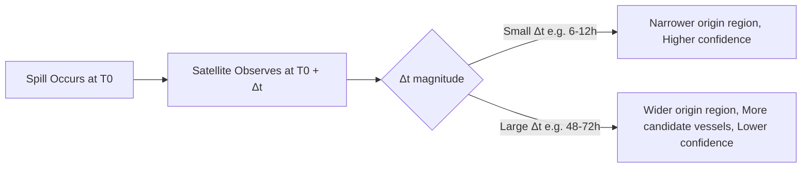

A **Data Freshness / Attribution Confidence** metric (`High` / `Medium` / `Low`) is derived from elapsed latency and origin-region size. The system is explicitly designed to **never** report high confidence when the origin region has grown large — confidence is bound to actual evidentiary tightness, not to elapsed processing effort.

---

## 22. Coastal Hydrodynamics

Near-shore transport (estuaries, ports, bays) is affected by tides, bathymetry-driven currents, and freshwater outflow that global/regional reanalysis products under-resolve.

**Hierarchical model selection [PROPOSED]:**
- **Open ocean:** global/regional CMEMS reanalysis currents.
- **Coastal zone:** higher-resolution local tidal/coastal model output, *if available* for the region.
- **Graceful degradation:** if no high-resolution coastal product is available (the common case for an MVP), the system flags the case as `COASTAL_LOW_RESOLUTION_FORCING` and **increases** origin-region uncertainty accordingly rather than silently using open-ocean-resolution currents in a coastal setting.


---

## 23. AIS Data Model

**Dynamic fields** (per position report): `mmsi`, `imo` (where transmitted), `timestamp (UTC)`, `latitude`, `longitude`, `sog` (speed over ground), `cog` (course over ground), `heading` (where available), `navigation_status` (where available).

**Static fields:** `vessel_name`, `vessel_type`, `call_sign`, `flag_state`, `length`, `beam`, `imo` (cross-referenced), plus any additional registry metadata available.

**PostgreSQL/PostGIS schema (conceptual):**
```sql
CREATE TABLE ais_vessels (
    mmsi            BIGINT PRIMARY KEY,
    imo             BIGINT,
    vessel_name     TEXT,
    vessel_type     TEXT,
    flag_state      TEXT,
    call_sign       TEXT,
    length_m        NUMERIC,
    beam_m          NUMERIC,
    metadata_quality TEXT  -- COMPLETE / PARTIAL / MISSING
);

CREATE TABLE ais_positions (
    id              BIGSERIAL PRIMARY KEY,
    mmsi            BIGINT REFERENCES ais_vessels(mmsi),
    ts              TIMESTAMPTZ NOT NULL,
    geom            GEOGRAPHY(Point, 4326) NOT NULL,
    sog_knots       NUMERIC,
    cog_deg         NUMERIC,
    heading_deg     NUMERIC,
    nav_status      TEXT,
    source          TEXT  -- e.g. 'marinecadastre', 'synthetic'
);
CREATE INDEX idx_ais_positions_geom ON ais_positions USING GIST (geom);
CREATE INDEX idx_ais_positions_ts   ON ais_positions (ts);
CREATE INDEX idx_ais_positions_mmsi_ts ON ais_positions (mmsi, ts);
```

---

## 24. AIS Spatial & Temporal Correlation

Given the origin polygon and estimated time window (§20), O.C.E.A.N. queries for vessels that:
1. Had a position intersecting (or within a feasibility buffer of) the origin polygon during the time window, **or**
2. Were within a *kinematically feasible* distance of the origin at the window's start, based on maximum plausible speed.

**Representative PostGIS query pattern:**
```sql
SELECT DISTINCT p.mmsi
FROM ais_positions p
WHERE p.ts BETWEEN :window_start AND :window_end
  AND ST_DWithin(p.geom, :origin_polygon::geography, :feasibility_buffer_m)
ORDER BY p.mmsi;
```
Uses `ST_Intersects`/`ST_DWithin` against a GIST-indexed geography column, with the AIS positions table time-partitioned (e.g., by day) for large historical volumes. This candidate list is deliberately over-inclusive at this stage — filtering to "irrelevant traffic removed" happens through the VSI scoring pipeline (§30), not through an overly aggressive spatial cutoff that could discard the true suspect.

---

## 25. Dark Vessel / AIS Gap Detection

When a vessel's AIS track shows a gap (no reports for an extended period) that spans the estimated release time:

**Workflow:** `Last known point → AIS gap begins → vessel reappears → reconstruct a feasible path corridor (not a single straight line) → test whether the corridor could intersect the origin polygon within the time window.`

The feasible corridor is bounded by the vessel's realistic maximum/minimum speed and turning constraints — a straight-line reconnection is **not** assumed to be physically representative, since vessels alter course.

**Gap classification:** `NORMAL_GAP` (short, consistent with known VHF coverage dead zones or routine outages), `SUSPICIOUS_GAP` (duration and location consistent with an AIS shutdown near the origin window), `HIGH_RISK_GAP` (gap timing and reconnection geometry strongly consistent with the origin polygon). **An AIS gap increases suspicion; it is never treated as proof of illegal discharge on its own.**

---

## 26. AIS Spoofing & Integrity Scoring

Anomaly indicators: implausible speed jumps, teleport-like position discontinuities, duplicate/overlapping MMSI reports, inconsistent COG vs. SOG vs. successive positions, and identity inconsistency (MMSI reused across differing static metadata).

A dedicated **AIS Integrity Score** is computed *per vessel track segment*, separate from the Vessel Suspicion Index (§30) — integrity issues indicate *data trustworthiness*, not guilt, and mixing the two would conflate "we cannot trust this vessel's reported track" with "this vessel is suspected of a discharge."

---

## 27. Congested Shipping Lanes

In busy lanes, the spatial/temporal query (§24) may return 20–50+ candidate vessels. Rather than forcing a binary guilty/not-guilty split, O.C.E.A.N. **ranks** all candidates by VSI (§30), incorporating: spatiotemporal overlap with the origin probability surface (not just a bounding-box check), speed anomaly relative to each vessel's own baseline, course deviation from its filed/typical route, AIS gaps, vessel type/profile, and historical route-behaviour consistency.

---

## 28. Ship-to-Ship Transfer Detection

When two vessels are simultaneously in close proximity with low relative movement for an extended period, in a context consistent with cargo/bunker transfer (open-water STS zones, timing, vessel types), the pair is flagged `STS_EVENT_CANDIDATE`. Both vessels are then independently evaluated against the origin evidence — flagging an STS event **does not** automatically assign blame to either vessel; it adds an additional evidence dimension for the analyst to consider.

---

## 29. Stationary Source Attribution

Not every spill originates from a moving vessel. O.C.E.A.N. assigns every case a `source_type` classification:

`MOVING_VESSEL` | `STATIONARY_INFRASTRUCTURE` (offshore platform, pipeline) | `WRECK_OR_DAMAGED_VESSEL` | `NATURAL_SEEP` | `UNKNOWN`

This classification is informed by whether the origin polygon overlaps known platform/pipeline locations (a static infrastructure geodatabase) versus AIS vessel density in that cell during the window — a materially different evidentiary path from vessel attribution, and reported as such.


---

## 30. Vessel Suspicion Index (VSI)

The VSI is an **explainable, weighted composite score** — not a black-box classifier output.

**Initial conceptual weighting [PROPOSED — configurable, requires calibration]:**

| Component | Weight | Symbol |
|---|---|---|
| Spatiotemporal proximity to origin | 40% | `F_loc` |
| Kinematic (speed/course) anomaly | 25% | `F_spd` |
| AIS evasion / gap behaviour | 25% | `F_gap` |
| Vessel profile plausibility | 10% | `F_prof` |

```
VSI_i = w1*F_loc(i) + w2*F_spd(i) + w3*F_gap(i) + w4*F_prof(i),   w1+w2+w3+w4 = 1
```

### 30.1 Spatiotemporal Score (`F_loc`)
Combines minimum geodesic distance from the vessel's track to the origin probability surface, the origin-surface probability density at the vessel's closest point, the time offset from the estimated release window, and hindcast model uncertainty. A Gaussian-style formulation is a reasonable starting point:
```
F_loc = exp( - d_min^2 / (2 * sigma_model^2) )
```
**Implementation caveat:** naive planar Euclidean distance between latitude/longitude pairs is geometrically invalid at any meaningful scale; `d_min` must be computed using proper **geodesic distance** (e.g., PostGIS `geography` type / Haversine or Vincenty) or in a locally projected equal-distance CRS — never raw degree differences.

### 30.2 Speed Anomaly (`F_spd`)
```
F_spd = max(0, (v_nominal - v_at_origin_time) / v_nominal)
```
`v_nominal` is the vessel's typical cruising speed from its historical track; `v_at_origin_time` is its speed during the estimated release window. **This must be normalized carefully and contextualized** — vessels that are normally slow (fishing vessels, vessels engaged in port maneuvering, or vessels under a legitimate traffic-separation-scheme restriction) should not be penalized for a "reduction" that is actually their baseline behaviour; the anomaly is measured *relative to that vessel's own typical profile*, not a fleet-wide constant.

### 30.3 AIS Gap Score (`F_gap`)
```
F_gap = min(1, gap_duration / gap_threshold)
```
`gap_threshold` is a configurable parameter. As stated in §25, **an AIS gap is one evidence feature, not proof of illegal discharge.**

### 30.4 Vessel Profile (`F_prof`)
A transparent lookup table over vessel type categories (oil/product/chemical tanker, bulk carrier, container ship, offshore supply vessel, tug, fishing, passenger, yacht, unknown), reflecting the *prior plausibility* that a given vessel class would be carrying/discharging oil-type cargo. **Vessel type alone must never be treated as evidence of guilt** — it only modestly adjusts the prior; a tanker with no spatial/temporal/kinematic anomaly should still rank low.

---

## 31. Evidence Fusion & Explainability

The system's output for a suspect is never a bare score. Every ranked vessel is presented with its full decomposition:

```
Vessel: [Name / MMSI]         VSI: 87 / 100
  Spatial overlap:        94
  Temporal overlap:       91
  Speed anomaly:          78
  AIS gap:               100
  Vessel profile:         100
Evidence quality: HIGH
Supporting evidence: [list]
Evidence reducing confidence: [list, e.g. "static metadata incomplete", "coastal low-resolution forcing"]
```

---

## 32. Confidence vs. Suspicion Framework

O.C.E.A.N. deliberately keeps five distinct metrics **separate** rather than collapsing them into one "truth probability," because they measure different things:

| Metric | Measures |
|---|---|
| Detection Confidence | How likely the SAR anomaly is genuinely an oil slick (vs. look-alike) |
| Origin Confidence | How tightly the hindcast constrains the origin region/time |
| AIS Integrity | How trustworthy a given vessel's reported track is |
| Attribution Confidence | Overall reliability of the case's suspect ranking, given data freshness/quality |
| Vessel Suspicion Index (VSI) | Relative ranking of *this* vessel among candidates, given the evidence |

Combining these into a single number would obscure *which* part of the pipeline is weak in a given case — e.g., a high VSI paired with low Origin Confidence should be read very differently from a high VSI paired with high Origin Confidence, and the dashboard (§33) always shows all five together.

---

## 33. Dashboard & Command Interface

A map-centric command-and-control dashboard with the following panels:

1. **Spill Overview** — case ID, status, detection thumbnail.
2. **Detection Confidence** — model confidence, look-alike check results.
3. **Environmental Conditions** — wind/current fields at acquisition time.
4. **Hindcast** — origin probability heatmap, confidence bands, time window.
5. **Suspect Vessels** — ranked list with VSI.
6. **VSI Breakdown** — per-component bar chart per vessel.
7. **Evidence Timeline** — chronological reconstruction (release window → detection → AIS events).
8. **Alerts** — active/historical alerts for the case.
9. **Dossier Generation** — one-click PDF report (§36).

---

## 34. Interactive Map Design

**Stack:** React + TypeScript, Mapbox GL JS (or Leaflet as a lighter-weight MVP alternative), optionally Deck.gl for large point-cloud AIS rendering.

**Layers:** satellite raster overlay, spill polygon, origin-probability heatmap (with 50/75/95% contour toggles), current vector field, wind vector field, vessel tracks, vessel markers (color-coded by VSI band), AIS-gap segments (dashed), natural-seep zones, coastal boundary/EEZ, port locations. A time slider scrubs through the reconstructed timeline (release window → observation → present).

---

## 35. End-to-End User Flow

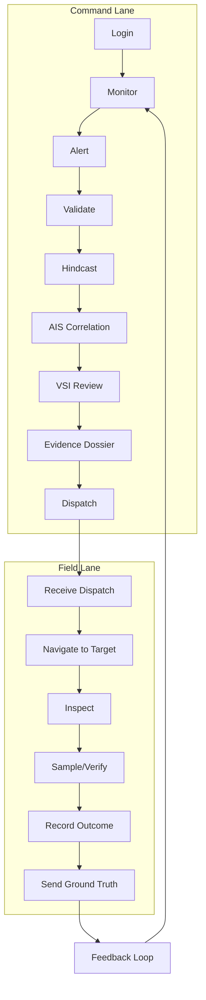

---

## 36. Evidence Dossier Generation

Auto-generated PDF containing: case ID; detection timestamp and satellite source/scene metadata; spill polygon and area; detection confidence; environmental conditions at acquisition; hindcast parameters and model version; origin probability map (with confidence bands) and estimated time window; AIS candidate list with vessel identities; trajectory evidence and AIS-gap segments; speed-anomaly plots; full VSI breakdown per suspect; explicit uncertainty statements at each stage; analyst notes; ground-truth field observations (once available); and a complete system audit trail (model versions, data sources, parameter settings used).

**Mandatory disclaimer printed on every dossier:**
> "This report provides analytical intelligence and probabilistic attribution. Final enforcement decisions require authorized human verification."

---

## 37. Alerting Framework

| Alert Type | Trigger | Default Severity |
|---|---|---|
| `NEW_SPILL_DETECTED` | Validated candidate slick found | Medium |
| `HIGH_CONFIDENCE_SPILL` | Detection confidence above threshold | High |
| `POTENTIAL_NATURAL_SEEP` | Seep-database overlap | Low |
| `HIGH_PRIORITY_SPILL` | Large area / sensitive ecological zone | Critical |
| `HIGH_RISK_VESSEL` | Top-ranked suspect VSI above threshold | High |
| `AIS_GAP_DETECTED` | Suspicious/high-risk gap on a candidate vessel | Medium |
| `ORIGIN_CONFIDENCE_LOW` | Origin region unusually large | Low (informational) |
| `FIELD_VERIFICATION_REQUIRED` | Case escalated by analyst | High |


---

## 38. Backend Architecture

**Recommended stack:** Python, FastAPI, PostgreSQL/PostGIS, Redis, Celery for background workers.

**Logical services:**
1. Ingestion service — pulls/normalizes satellite, AIS, and met-ocean data.
2. Preprocessing service — SAR calibration/filtering pipeline.
3. Detection service — U-Net inference.
4. Validation service — look-alike/seep/weather filtering.
5. Hindcast service — PyGNOME orchestration + Monte Carlo aggregation.
6. AIS service — spatial/temporal query and behaviour analysis.
7. Attribution service — VSI scoring and ranking.
8. Reporting service — dossier generation.
9. Notification service — alerting.

**Modular monolith vs. microservices:** For the SIH MVP timeframe, a **modular monolith** (single FastAPI deployment with clearly separated internal modules/service classes, backed by Celery workers for heavy async jobs) is recommended over full microservices. Rationale: microservice overhead (service discovery, inter-service auth, distributed tracing) consumes hackathon time without functional benefit at this scale, while a well-modularized monolith still supports a clean migration path to microservices in the Production Scope (§75) if genuinely needed later — the priority is a working, well-organized code base, not a distributed-systems demo.

---

## 39. Database Design

| Table | Purpose | Key fields |
|---|---|---|
| `users`, `roles` | Access control | id, username, role_id |
| `cases` | Master case record | id, status, created_at, source_type |
| `satellite_acquisitions` | Scene metadata | id, sensor, acquisition_ts, footprint (geom) |
| `spill_detections` | Model output per scene | id, case_id, confidence, model_version |
| `spill_polygons` | Vectorized geometry | id, detection_id, geom (Polygon), area_km2 |
| `environmental_observations` | Wind/current snapshot | id, case_id, wind_u, wind_v, current_u, current_v, ts |
| `hindcast_runs` | Simulation metadata | id, case_id, n_particles, model_version, params |
| `origin_probability_maps` | Raster/contour output | id, run_id, raster_ref, contour_50, contour_75, contour_95 |
| `ais_vessels`, `ais_positions` | AIS data (§23) | see §23 schema |
| `ais_gaps` | Detected gaps | id, mmsi, gap_start, gap_end, classification |
| `vessel_anomalies` | Behaviour features | id, mmsi, case_id, feature_type, value |
| `vessel_scores` | VSI results | id, case_id, mmsi, vsi_total, f_loc, f_spd, f_gap, f_prof |
| `natural_seeps` | Seep geodatabase | id, geom, recurrence_count |
| `evidence_items` | Dossier components | id, case_id, type, ref |
| `investigation_reports` | Generated dossiers | id, case_id, pdf_ref, generated_at |
| `field_verifications` | Ground truth | id, case_id, outcome, notes, submitted_by |
| `alerts` | Alert records | id, case_id, type, severity, created_at |
| `audit_logs` | Full action trail | id, actor, action, entity, ts |

All spatial tables carry a `geom`/`geography` column with a GIST index; all event tables carry an indexed `ts`/timestamp column.

---

## 40. PostGIS Spatial Design

- `geometry` vs `geography`: `geography` used for accurate distance/area calculations over large extents (e.g., AIS proximity queries spanning many degrees); `geometry` (projected, e.g., UTM) used for precise area/perimeter computation on spill polygons (§17).
- All geometries stored with explicit `SRID=4326` (WGS84) at the storage layer; computations requiring true distance/area reproject as needed.
- GIST indexes on every spatial column used in `ST_Intersects`/`ST_DWithin` predicates.
- Representative queries: vessel-in-polygon-during-window (§24), seep-buffer intersection (§12), bounding-box case list for the dashboard map viewport.

---

## 41. API Specification (representative)

| Method & Path | Purpose |
|---|---|
| `POST /api/v1/cases` | Create a new case from a detection |
| `GET /api/v1/cases` | List cases (filterable by status/date/region) |
| `GET /api/v1/cases/{id}` | Case detail |
| `POST /api/v1/detections` | Submit/trigger a detection run |
| `GET /api/v1/detections/{id}` | Detection result |
| `POST /api/v1/hindcast/{case_id}` | Trigger hindcast job |
| `GET /api/v1/hindcast/{case_id}` | Hindcast status/result |
| `GET /api/v1/cases/{id}/vessels` | Candidate vessels for a case |
| `GET /api/v1/cases/{id}/suspects` | Ranked VSI suspects |
| `GET /api/v1/vessels/{mmsi}` | Vessel profile/history |
| `POST /api/v1/cases/{id}/verify` | Submit field verification outcome |
| `POST /api/v1/reports` | Generate evidence dossier |
| `GET /api/v1/alerts` | Active/historical alerts |

Each endpoint defines: request schema (JSON), response schema, standard HTTP status codes (`200/201/202/400/401/403/404/409/422/500`), authentication (JWT bearer token, §43), authorization (role-based, §43), and structured error responses (`{"error_code": ..., "message": ..., "details": ...}`).

---

## 42. Asynchronous Processing

Hindcast simulation and large-raster preprocessing are long-running; they are dispatched as **Celery tasks** via a Redis broker, with the frontend polling a status endpoint or subscribing over WebSocket/SSE for progress.

**Job states:** `QUEUED → RUNNING → COMPLETED | FAILED | CANCELLED`

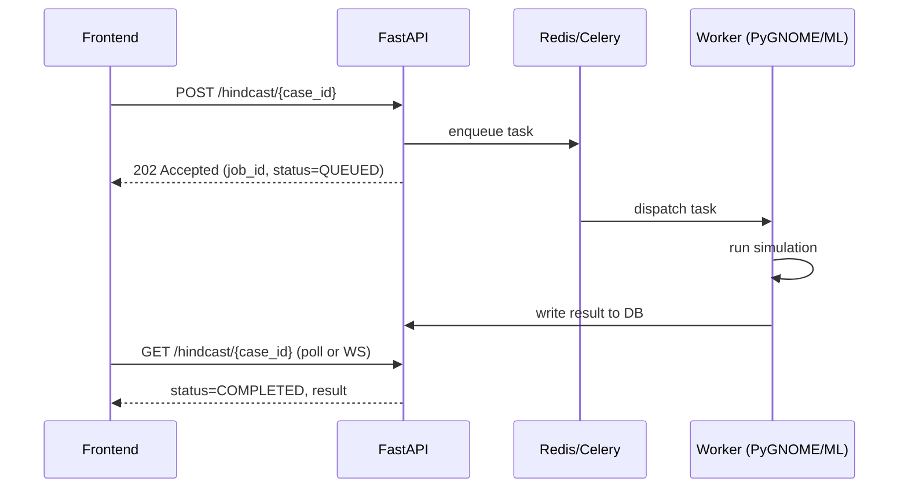

---

## 43. Security Architecture

JWT-based authentication; Role-Based Access Control (RBAC) mapped to the personas in §5; encryption at rest for the database and object storage, and in transit (TLS); centralized secrets management (never hard-coded credentials); audit logging of every state-changing action (§54); API rate limiting; strict input validation on all endpoints (especially file/raster uploads); secure handling of uploaded field-verification media; digitally signed evidence dossiers with tamper-evident hashing; a defined data-retention policy; and attention to PII handling where vessel crew or reporting-officer identity data is involved.

---

## 44. Model & Data Integrity

Considerations: malformed/corrupted satellite files (validated on ingestion, §72), manipulated or spoofed AIS (§26), adversarial or out-of-distribution model inputs, data-poisoning risk in any future continuous-retraining pipeline (§57), strict model versioning and a model registry, and reproducibility (every case stores the exact model/version/parameters used, §54).

---

## 45. ML Model Management

Recommended (optional for MVP, valuable for Production): experiment tracking (e.g., MLflow), hyperparameter search (e.g., Optuna), and portable inference via ONNX. Defines a minimal pipeline: dataset version → training run → evaluation → registry entry → deployment → rollback capability. These tools are marked **optional** for the hackathon; the MVP can use simple versioned model checkpoint files with a manifest recording dataset version, hyperparameters, and evaluation metrics.

---

## 46. Model Evaluation Metrics

| Stage | Metrics |
|---|---|
| Detection (segmentation) | IoU, Dice, Precision, Recall, F1, false-positive rate per scene |
| Attribution | Top-1 suspect accuracy, Top-3 suspect recall, rank correlation vs. ground truth, spatial/temporal error of estimated origin |
| Hindcast | Origin localization error (distance from estimated to true origin, on labelled/synthetic cases), confidence calibration (do 75%-band claims actually contain truth ~75% of the time?) |
| System | API latency, end-to-end processing time, throughput, async job completion rate |

---

## 47. Ground Truth Strategy

Ground truth is inherently scarce for illegal discharges (the responsible vessel is rarely independently confirmed). Sources used: known historical/labelled spill cases (including the Zenodo dataset), labelled satellite imagery, publicly documented vessel-source incidents, and synthetic simulated scenarios with a known injected answer. **Ground truth and synthetic demonstration data are tracked as clearly distinct dataset types** in the schema (`source` field, §23) and are never merged or presented interchangeably.

---

## 48. Synthetic Data Strategy

Where real historical AIS/environmental data is unavailable for a chosen demo region [ASSUMPTION, per SIH's own dataset guidance], O.C.E.A.N. generates a reproducible synthetic AIS scenario containing a realistic mixture: an innocent background vessel, a tanker with a plausible legitimate track, a "suspicious" tanker exhibiting an engineered anomaly (AIS gap + speed drop near the origin window), additional normal traffic, and congested-lane density. **Synthetic scenarios are clearly labelled as such in the UI and in generated dossiers and are never presented as real evidentiary data.**

---

## 49. SIH Demo Scenario

1. Historical Sentinel-1 scene (or synthetic-region equivalent) is loaded.
2. Detection model flags a dark-slick candidate with a confidence score.
3. Look-alike checks run (wind, seep-database, temporal persistence) and the candidate is validated.
4. Spill polygon, area, and shape descriptors are generated.
5. Hindcast is triggered; a Monte Carlo origin probability map and time window are produced.
6. AIS vessels within the origin polygon/window are queried and displayed.
7. Candidate list is filtered/ranked by VSI.
8. The demo's engineered "suspicious tanker" — with matching spatial overlap, correct timing, a speed reduction, and an AIS gap — ranks #1.
9. The dashboard displays the full VSI evidence breakdown.
10. A PDF evidence dossier is generated on demand.
11. The analyst marks the case for field verification, closing the demo loop.


---

## 50. Edge Case Matrix

| # | Condition | Impact | Detection | Mitigation | Fallback | UI Treatment | Confidence Impact | Status |
|---|---|---|---|---|---|---|---|---|
| 1 | Natural oil seep | False attribution risk | Seep-DB overlap (§12) | Recurrence/persistence check | Classify `NATURAL_SEEP_CANDIDATE` | Distinct badge, low priority | Detection conf. unaffected; attribution suppressed | MVP |
| 2 | Low wind | Look-alike false positive | Wind < threshold from ERA5 | Down-weight in OilConfidence | Flag `LOW_WIND_UNCERTAIN` | Warning banner | Detection confidence reduced | MVP |
| 3 | High wind | Backscatter anomaly | Wind > threshold | Down-weight | Flag `HIGH_WIND_UNCERTAIN` | Warning banner | Reduced | MVP |
| 4 | Rain | Precipitation contamination | ERA5 precip flag | Exclude/flag scene region | Reject or mark uncertain | Warning banner | Reduced | MVP |
| 5 | Sun glint | Optical corroboration invalid | Solar/view geometry check | Skip optical corroboration | Fall back to SAR-only | Note in evidence panel | Multi-sensor bonus withheld | MVP |
| 6 | Clouds | Optical unusable | Scene classification | Skip optical | SAR-only | Note | Multi-sensor bonus withheld | MVP |
| 7 | Merged spills | Biased single-origin hindcast | Connected components | Component separation | Independent per-region cases; full multi-hypothesis is advanced | Multiple case cards | Origin confidence per sub-case | MVP basic / ADV full |
| 8 | Subsurface oil | Under-detection | N/A (sensor limit) | Documented limitation | None (out of scope) | Explicit limitation notice | N/A | Documented limitation |
| 9 | Weathered oil | Under-detection / mis-sizing | Reduced signature | Weathering model (§18) | Wider uncertainty | Age/weathering caveat shown | Reduced | MVP (basic) |
| 10 | Evaporation | Volume mis-estimation | N/A | PyGNOME/ADIOS weathering | Probabilistic volume range | Range, not point value | N/A | ADV |
| 11 | Coastal hydrodynamics | Poor forcing resolution | Region check vs. coastal mask | Local model if available | Increase uncertainty; flag `COASTAL_LOW_RESOLUTION_FORCING` | Warning badge | Origin confidence reduced | MVP flag / ADV resolve |
| 12 | Satellite latency | Enlarged origin region | Δt from acquisition metadata | N/A (physics-driven) | Wider Monte Carlo spread | Confidence badge (§21) | Reduced with Δt | MVP |
| 13 | AIS gap | Missed suspect track | Gap detection (§25) | Corridor reconstruction | Gap classification | Dashed track segment | Adds suspicion, not proof | MVP |
| 14 | AIS spoofing | False track trust | Integrity checks (§26) | AIS Integrity Score | Down-weight track | Integrity badge | Separate metric | MVP basic |
| 15 | Congested traffic | Large candidate set | Query returns many vessels | VSI ranking (§30) | Ranked list, not binary filter | Sortable table | N/A | MVP |
| 16 | STS transfer | Ambiguous dual-vessel event | Proximity + low relative motion | STS flag (§28) | Evaluate both vessels | STS badge on both | N/A | ADV |
| 17 | Stationary source | Vessel attribution invalid | Low AIS density + infra overlap | `source_type` classification (§29) | Route to infrastructure investigation | Distinct case type | N/A | MVP basic |
| 18 | Offshore platform | Non-vessel source | Infra geodatabase overlap | `STATIONARY_INFRASTRUCTURE` | N/A | Distinct case type | N/A | MVP basic |
| 19 | Pipeline leak | Non-vessel source | Pipeline geodatabase overlap | Same as above | N/A | Distinct case type | N/A | ADV |
| 20 | Damaged/sunken vessel | Ongoing chronic source | Repeated detections at fixed point | Persistence + AIS last-known | `WRECK_OR_DAMAGED_VESSEL` | Distinct case type | N/A | ADV |
| 21 | Missing environmental data | Degraded hindcast | `data_quality` flag (§9) | Use best available reanalysis | Wider uncertainty | Data-quality badge | Reduced | MVP |
| 22 | Missing AIS data | Incomplete candidate set | Coverage check | N/A | Flag `AIS_COVERAGE_GAP` | Warning | Attribution confidence reduced | MVP |
| 23 | Bad satellite acquisition | Corrupted/partial scene | Ingestion validation | Reject scene | Request re-acquisition | Error state | N/A | MVP |
| 24 | False segmentation | Spurious mask | Confidence threshold | Look-alike layer (§11) | Human review queue | `UNCERTAIN_REQUIRES_REVIEW` | N/A | MVP |
| 25 | Model confidence low | Ambiguous detection | Threshold check | Route to manual review | Manual classification | Review queue badge | N/A | MVP |
| 26 | Conflicting data sources | Inconsistent forcing/AIS | Cross-source validation | Prefer higher-quality source; flag conflict | Present both, flagged | Conflict badge | Reduced | MVP basic |

---

## 51. Risk Register

| Category | Risk | Probability | Severity | Score | Mitigation | Fallback |
|---|---|---|---|---|---|---|
| Technical | PyGNOME integration complexity exceeds hackathon time | Medium | High | High | Start integration in Phase 0; use documented examples | Simplified particle-advection stub with same interface |
| Data | Real AIS/imagery access restricted | Medium | Medium | Medium | Use Zenodo + MarineCadastre + synthetic per SIH guidance | Fully synthetic demo scenario |
| Scientific | Look-alike filter false-negative rate too high | Medium | Medium | Medium | Conservative thresholds; human review queue | Manual override always available |
| Operational | Team member unavailability | Low | Medium | Low | Clear role separation (§61) | Cross-trained backup owner per module |
| Security | Sensitive vessel data exposure | Low | High | Medium | RBAC, encryption, no public demo of real MMSI data | Use synthetic MMSIs for public demo |
| Performance | Hindcast job too slow for live demo | Medium | Medium | Medium | Pre-computed demo case + smaller N for live runs | Cached "gold" demo run |
| Legal | Report perceived as an accusation | Low | High | Medium | Mandatory disclaimer (§36), human-in-the-loop (§56) | Legal review of wording pre-submission |
| AI/ML | Model overfits to a single dataset region | Medium | Medium | Medium | Scene-level split; diverse validation scenes | Report metrics with explicit dataset scope caveat |
| Availability | External data API downtime during demo | Medium | Medium | Medium | Cache all demo-critical data locally in advance | Fully offline demo mode (§82) |

---

## 52. Non-Functional Requirements

| Category | Target | Label |
|---|---|---|
| API response time (simple reads) | < 500 ms p95 | Prototype target |
| Hindcast job completion | < 5 min for demo-scale ensemble (N≈500–1000) | Prototype target |
| Dashboard map load | < 3 s initial render | Prototype target |
| Availability | Best-effort during demo; no formal SLA | Prototype target |
| Availability | 99.5%+ | Production target |
| Security | RBAC + TLS + audit logging | Prototype target (baseline) |
| Scalability | Single-region demo dataset | Prototype target |
| Scalability | Multi-region, streaming AIS ingestion | Production target |
| Maintainability | Modular monolith, documented modules | Prototype target |
| Observability | Structured logs + basic health endpoint | Prototype target |
| Observability | Full metrics/tracing stack (§53) | Production target |
| Explainability | Every VSI decomposed into named components | Prototype target (mandatory, not deferred) |
| Accessibility | Basic keyboard navigation, readable contrast | Prototype target |

---

## 53. Observability

MVP: structured JSON logs, a `/health` endpoint per service, and basic job-status tracking in the database. **Production-scope (optional, marked [PROD]):** Prometheus metrics, Grafana dashboards, OpenTelemetry tracing across ingestion, detection, hindcast, AIS, and reporting stages; data-quality metrics (missing-field rates per source); pipeline-failure counters; satellite/AIS ingestion-failure alerts.

---

## 54. Auditability

Every case persists: source data references and versions, model version(s) used at each stage, model confidence values, input timestamps, environmental-data product versions, hindcast parameters (N, thresholds, seed), AIS query time window, VSI scoring weights in effect, every analyst action (approve/reject/override/note), report version, and field-verification result. This makes every case **reproducible**: re-running with the recorded parameters against the recorded data version should regenerate the same result.

---

## 55. Explainability Framework

(See also §31.) For every suspect, the system must be able to answer "why was this vessel ranked highly?" with a concrete, itemized breakdown, plus two explicit lists: **"Evidence supporting ranking"** and **"Evidence reducing confidence."** No suspect is presented with a bare numeric score and no explanation.

---

## 56. Human-in-the-Loop Design

**Core principle: the AI recommends, the authority decides.** The analyst can approve, reject, mark false-positive, mark natural-seep, request re-analysis, override any automated classification, add supplementary evidence, add free-text notes, and initiate field verification. **Every override is logged** (§54) with the actor, timestamp, and stated reason, preserving a complete decision trail distinct from the automated recommendation.

---

## 57. Feedback Loop

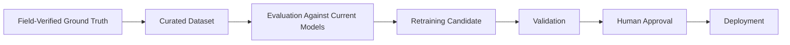
Ground-truth outcomes can improve segmentation thresholds, look-alike filter weights, AIS-anomaly thresholds, VSI component weights, and environmental-model calibration. **Models are never automatically retrained and redeployed without a validation and human-approval gate** — this prevents silent model drift or poisoning from a single mislabeled field report.


---

## 58. MVP Scope

The smallest **impressive, working, end-to-end** hackathon prototype:

1. Historical Sentinel-1 oil-spill scene (Zenodo dataset) as input.
2. U-Net (or comparable) segmentation model producing a spill mask/polygon.
3. Basic look-alike/environmental validation (wind + seep-database check).
4. Historical (MarineCadastre) or synthetic AIS for the demo region/time.
5. Basic ocean current/wind data (CMEMS/ERA5) for the demo window.
6. PyGNOME-based forward-simulation trajectory ensemble (§19).
7. Probabilistic origin region (Monte Carlo, reduced N for demo speed).
8. PostGIS-based vessel spatial/temporal filtering.
9. VSI scoring with full explainable breakdown.
10. Interactive map-based dashboard (single demo case).
11. PDF evidence report generation.
12. Basic case state machine and audit log.

## 59. Advanced / Future Scope

Marked explicitly as **not** part of the hackathon MVP: multi-satellite sensor fusion (SAR + optical + thermal, fully automated); live tasked satellite ingestion; live licensed AIS streaming; real-time event streaming architecture; high-resolution coastal hydrodynamic models; transformer-based segmentation architectures; a learned (rather than rule-based) vessel-anomaly model; graph-based multi-vessel attribution reasoning; formal confidence calibration studies; federated multi-agency intelligence sharing; edge/offline deployment for patrol vessels; drone-based low-altitude verification integration; active-learning loops for continuous model improvement; a fully automated, legally-chain-of-custody evidence pipeline; and a longer-term "national maritime digital twin" vision combining all of the above into a continuously running situational-awareness platform for NTRO/Coast Guard.

## 60. Implementation Roadmap

| Phase | Objective | Key Tasks | Deliverable | Key Risk |
|---|---|---|---|---|
| 0 | Environment setup | Repo, Docker Compose, DB schema bootstrap | Running skeleton stack | Setup delays |
| 1 | Dataset & preprocessing | Acquire Zenodo/MarineCadastre data; build ingestion pipeline | Ingested, normalized dataset | Data format inconsistency |
| 2 | Oil-spill segmentation | Train/fine-tune U-Net; evaluate IoU/Dice | Working detection service | Training time/compute |
| 3 | Validation/look-alike | Implement wind/seep filters; confidence fusion | Validated detections | Threshold tuning |
| 4 | AIS/PostGIS | Load AIS data; build spatial schema/queries | Vessel query service | Query performance at scale |
| 5 | Hindcast | Integrate PyGNOME; build Monte Carlo orchestration | Origin probability service | PyGNOME integration complexity |
| 6 | VSI | Implement scoring components and fusion | Ranked suspect API | Weight calibration |
| 7 | Dashboard | Build map UI, panels, time slider | Interactive frontend | Map layer performance |
| 8 | Evidence/reporting | PDF dossier generator | Evidence dossier output | Report layout/time |
| 9 | Integration/testing | End-to-end wiring, test scenarios | Stable demo build | Integration bugs |
| 10 | Demo/polish | Rehearse demo scenario, fallback prep | Final SIH presentation | Live-demo failure |

Each phase's acceptance criterion is a working, demonstrable increment — e.g., Phase 2 is accepted when the detection service returns a mask and confidence score for a held-out test scene via API.

## 61. Team Role Distribution

| Role | Responsibilities |
|---|---|
| AI/ML Engineer | Segmentation model training/evaluation, VSI scoring implementation |
| Remote Sensing / GIS Engineer | SAR preprocessing, spill characterization, PostGIS spatial design |
| Backend Engineer | FastAPI services, async job orchestration, API design |
| Frontend Engineer | Dashboard, map, evidence UI |
| Database Engineer | Schema design, indexing, query optimization |
| Physics/Model Integration Engineer | PyGNOME orchestration, Monte Carlo pipeline, weathering models |
| Documentation/Presentation Lead | PRD maintenance, demo script, judge-facing materials |

## 62. Testing Strategy

Unit tests (per-module logic: characterization formulas, VSI components), integration tests (service-to-service, e.g., detection → validation), API tests (contract tests per endpoint in §41), ML tests (segmentation metric regression thresholds on a fixed held-out set), GIS tests (spatial query correctness against known fixtures), simulation tests (PyGNOME orchestration determinism given a fixed seed), data-validation tests (ingestion rejects malformed inputs), UI tests (critical dashboard flows), security tests (authz boundary checks), performance tests (hindcast job latency under demo-scale load), and end-to-end tests (the full demo scenario, §49, run automatically as a regression check).

## 63. Acceptance Criteria

| Capability | Acceptance Criterion |
|---|---|
| Detection | System produces a spill mask and confidence score for a given scene |
| Characterization | System computes area, perimeter, and shape descriptors for a validated polygon |
| Hindcast | System produces a probabilistic origin region and time window |
| AIS Correlation | System retrieves the correct candidate-vessel set for a known test case |
| VSI | System ranks candidates with a fully itemized, explainable score |
| Dashboard | User can visually inspect detection, hindcast, and suspect evidence in one interface |
| Reporting | User can generate a PDF evidence dossier for a case |
| Uncertainty | Every stage's output is accompanied by an explicit confidence/uncertainty indicator |

## 64. Success Metrics

Detection: IoU, recall, false-positive rate on held-out scenes. Attribution: Top-3 suspect recall on labelled/synthetic test cases, origin localization error. Hindcast: confidence-band calibration. System: dossier generation time, dashboard response time, end-to-end demo run time.

## 65. Competitive Differentiation

Compared to a standalone satellite oil-spill detector, a standalone AIS visualization tool, a standalone weather dashboard, or a standalone GIS platform, O.C.E.A.N.'s differentiator is the **complete evidentiary chain**: `DETECTION + VALIDATION + PHYSICS + AIS + BEHAVIOUR + EXPLAINABLE ATTRIBUTION`, delivered as one auditable workflow rather than several disconnected tools an analyst would otherwise have to manually reconcile.

## 66. Innovation Summary

Carefully validated (not overstated) innovations: (1) multi-modal look-alike filtering combining SAR, met-ocean, and seep-history evidence; (2) probabilistic hindcasting producing a confidence-banded origin region instead of a single point; (3) integrated AIS-plus-physics correlation rather than naive proximity matching; (4) explainable, component-decomposed vessel suspicion scoring; (5) dark-vessel / AIS-gap corridor analysis; (6) an evidence-oriented (not verdict-oriented) dashboard and dossier; (7) mandatory human-in-the-loop verification at every decision point; (8) a closed-loop ground-truth feedback pipeline with a validation gate before any retraining.

## 67. Research Foundation

Relevant scientific foundations informing this design (cited at the level of established topic areas; specific papers/DOIs should be verified by the team before final submission rather than assumed):
- SAR-based oil-spill detection and look-alike discrimination literature (e.g., work by **Brekke & Solberg** on satellite remote sensing for oil-spill detection).
- Oil-spill trajectory/fate modelling literature associated with **NOAA's GNOME/ADIOS** tools.
- Published work on oil-spill drift/reverse-drift modelling concepts (e.g., research associated with **Zodiatis et al.** on oil-spill forecasting in the Mediterranean).
- AIS trajectory-anomaly-detection literature (maritime domain awareness research).
- General SAR remote-sensing methodology literature.
*(Note: citation details above should be independently verified against original sources before being printed in a submission document; no DOIs or exact publication details are asserted here to avoid fabricated references.)*

## 68. Technology Stack

| Layer | Technology | Why |
|---|---|---|
| Core language | Python 3.11+ | ML/GIS ecosystem maturity |
| ML | PyTorch | Segmentation model training |
| CV/Image | OpenCV | Preprocessing utilities |
| Geospatial raster | GDAL / Rasterio | Satellite raster I/O |
| Geospatial vector | GeoPandas, Shapely | Polygon operations |
| Numerics | NumPy, Pandas | Data wrangling |
| Physics engine | PyGNOME (+ ADIOS) | Oil transport/fate simulation |
| API | FastAPI | Async-friendly, typed, fast to build |
| Database | PostgreSQL + PostGIS | Relational + spatial queries |
| Cache/Queue | Redis | Celery broker, caching |
| Workers | Celery | Long-running job orchestration |
| Frontend | React + TypeScript | Component-based dashboard |
| Mapping | Mapbox GL JS / Leaflet, optional Deck.gl | Interactive geospatial UI |
| Containerization | Docker | Reproducible environment |
| Optional (Prod) | MLflow, Prometheus, Grafana, OpenTelemetry, ONNX Runtime | Model tracking, observability, portable inference |


---

## 69. System Architecture Diagrams

### 69.1 High-Level Architecture
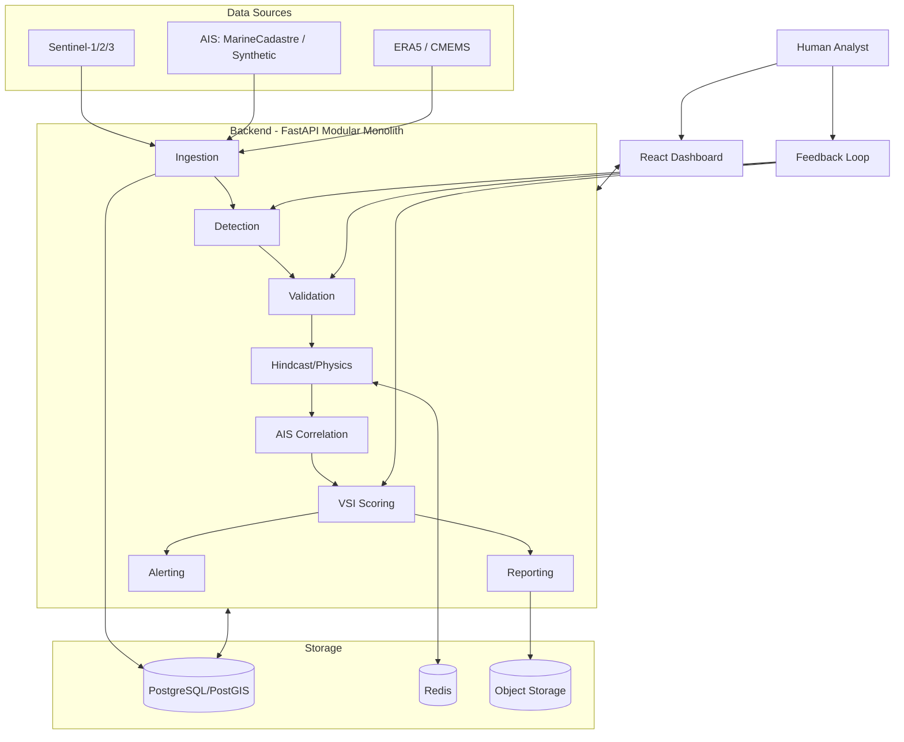

### 69.2 ML Pipeline
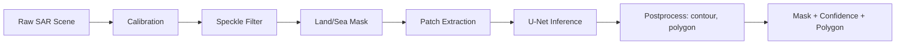

### 69.3 Hindcast Pipeline
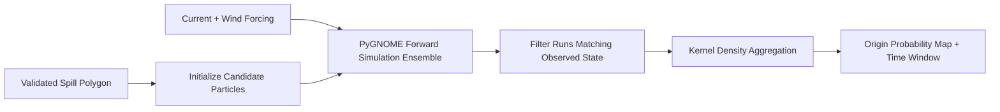

### 69.4 Attribution Pipeline
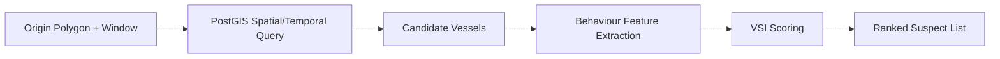

### 69.5 Entity-Relationship Diagram (simplified)
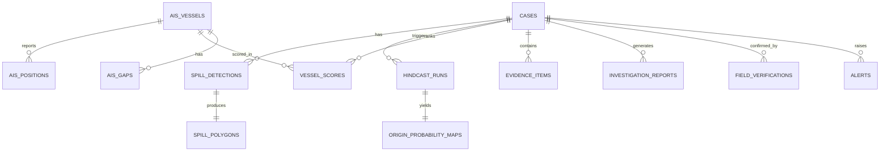

## 70. Sequence Diagram (End-to-End Case)

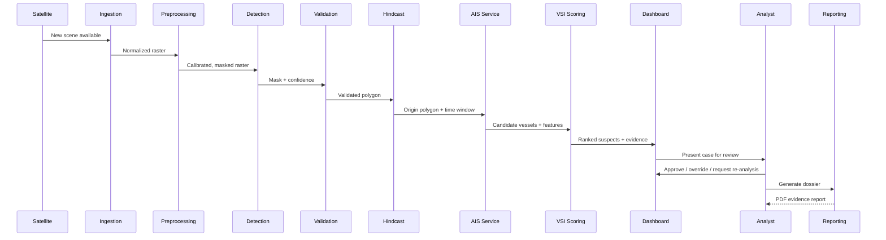

## 71. Case State Machine

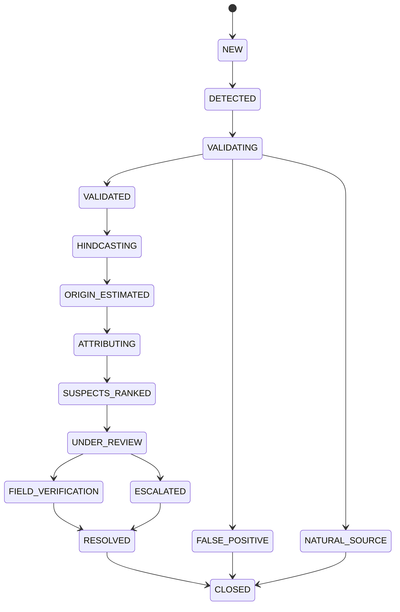
Transitions occur only via explicit backend actions (automated stage completion or analyst decision); no state is skipped, preserving a complete auditable history per case (§54).

## 72. Data Quality Framework

Validation rules applied at ingestion:

| Source | Rule |
|---|---|
| Satellite | Timestamp validity, footprint within expected geographic bounds, no corrupted/truncated raster blocks |
| AIS | Duplicate-record detection, impossible-speed rejection (flag, don't silently drop), coordinate range validation |
| Weather/Ocean | Staleness check (data age vs. required window), CRS consistency, missing-value masking |

Every ingested record carries a `data_quality` enum (`COMPLETE`/`PARTIAL`/`MISSING`) that downstream modules must check before use (§9); a `PARTIAL` or `MISSING` flag on a required field triggers a corresponding uncertainty increase rather than a default value being silently substituted.

## 73. Uncertainty Framework

Uncertainty is carried, stage by stage, and never collapsed into a single figure without explanation:

```
Detection uncertainty
   ↓
Spill characterization uncertainty
   ↓
Environmental forcing uncertainty
   ↓
Hindcast uncertainty
   ↓
AIS data uncertainty
   ↓
Attribution uncertainty
```

Represented via: confidence bands (50/75/95% origin regions, §20), explicit probability maps rather than point estimates, categorical evidence-quality labels (`High`/`Medium`/`Low`), and separate data-quality vs. model-quality indicators (§9, §72) so an analyst can distinguish "the model is unsure" from "the input data was incomplete."

## 74. Legal & Ethical Considerations

The platform is explicitly designed as a **decision-support tool for authorities, not an autonomous adjudicator**. Key considerations: the risk of false accusation from probabilistic evidence is mitigated by mandatory human review (§56) and explicit uncertainty communication (§32, §73) at every stage; full auditability (§54) supports later legal/regulatory scrutiny of how a conclusion was reached; AIS data handling must respect applicable data-licensing and privacy/access restrictions for the jurisdiction and data provider; generated evidence reports carry integrity/authenticity safeguards (§43); the system is designed to apply the same evidentiary standard regardless of vessel flag, operator, or type, avoiding discriminatory bias in scoring (§30.4); and the platform's stated purpose throughout — in UI copy, dossiers, and this PRD — is to **assist** investigation, never to autonomously declare culpability.

## 75. Deployment Architecture

**Development:** Docker Compose bundling FastAPI, PostgreSQL/PostGIS, Redis, Celery worker(s), and the React frontend for local/demo use.

**Production [PROD]:** Containerized API and worker tiers behind a load balancer, managed PostgreSQL/PostGIS, managed Redis, object storage for rasters/reports, a dedicated ML inference tier, a monitoring stack (§53), and a separately deployed frontend. Given the sensitivity of maritime enforcement intelligence, **government deployment may require controlled or on-premise infrastructure** rather than public cloud, subject to NTRO/Coast Guard IT policy — this PRD does not assume a specific hosting decision.

## 76. Storage Architecture

| Data class | Store |
|---|---|
| Structured/relational + spatial | PostgreSQL/PostGIS |
| Raster/large binary objects (scenes, heatmaps) | S3-compatible object storage |
| Model artifacts | Model registry / object storage |
| Generated reports (PDF) | Object storage |
| Logs | Centralized logging (file-based for MVP; log aggregator for Production) |

## 77. Failure Handling

The system is designed to **degrade gracefully**, never to silently fabricate a confident result from missing inputs.

| Failure | System Behaviour |
|---|---|
| Satellite source unavailable | Case cannot proceed past ingestion; clearly flagged, no synthetic substitution presented as real |
| AIS unavailable | "Attribution unavailable — detection and origin analysis can continue." Case proceeds through hindcast, halts before VSI ranking |
| Weather/ocean-current data unavailable | "Origin confidence reduced." Hindcast proceeds with wider uncertainty or is blocked if forcing is entirely missing |
| PyGNOME simulation failure | Job marked `FAILED`; analyst notified; retry with adjusted parameters offered |
| ML model inference failure | Detection marked `FAILED`; scene queued for manual review |
| Database unavailable | API returns `503`; no partial/corrupted writes (transactional boundaries enforced) |
| Map tile service unavailable | Dashboard falls back to a basic vector-only map |
| Report generation failure | Retry queued; raw evidence still viewable in dashboard even if PDF fails |


---

## 78. Requirement ID Register

Priority: **P0** = mandatory for MVP demo, **P1** = important, **P2** = enhancement.

### Functional Requirements

| ID | Priority | Description | Acceptance Criteria |
|---|---|---|---|
| FR-DET-001 | P0 | System shall ingest a Sentinel-1 SAR scene and produce a binary spill mask | Given a test scene, API returns a mask and confidence score |
| FR-DET-002 | P0 | System shall vectorize the mask into a polygon with geometric properties | Polygon area/perimeter/centroid returned within tolerance of ground truth |
| FR-DET-003 | P1 | System shall estimate approximate spill age with an explicit confidence range | Age range + confidence label returned, never a bare single number |
| FR-VAL-001 | P0 | System shall compute an OilConfidence score combining model + wind + shape features | Score changes appropriately when wind/shape features are varied in test fixtures |
| FR-VAL-002 | P0 | System shall check candidate spills against the natural-seep geodatabase | Known seep-location test case is classified `NATURAL_SEEP_CANDIDATE` |
| FR-HIN-001 | P0 | System shall run a Monte Carlo hindcast producing an origin probability map | 50/75/95% contour regions returned for a test case |
| FR-HIN-002 | P0 | System shall produce an estimated release time window | Time window returned with explicit uncertainty range |
| FR-AIS-001 | P0 | System shall query candidate vessels intersecting the origin polygon/window | Known synthetic suspect vessel appears in candidate list |
| FR-AIS-002 | P1 | System shall detect and classify AIS gaps | Engineered gap in synthetic data is classified correctly |
| FR-AIS-003 | P1 | System shall compute an AIS Integrity Score per vessel track | Score reflects injected anomalies in test fixtures |
| FR-VSI-001 | P0 | System shall compute a decomposed VSI per candidate vessel | Score breakdown includes all four named components |
| FR-VSI-002 | P0 | System shall rank candidates by VSI, not binary classify | Output is an ordered list, not a pass/fail flag |
| FR-UI-001 | P0 | Dashboard shall display spill, origin, and suspect evidence on one map | Manual UI walkthrough confirms all layers render |
| FR-RPT-001 | P0 | System shall generate a PDF evidence dossier per case | Dossier contains all required sections (§36) and disclaimer |
| FR-HITL-001 | P0 | Analyst shall be able to override any automated classification | Override action is logged with actor/timestamp/reason |

### Non-Functional Requirements

| ID | Priority | Description |
|---|---|---|
| NFR-PERF-001 | P0 | Hindcast job completes within demo-acceptable time for reduced ensemble size |
| NFR-PERF-002 | P1 | Dashboard initial map render under 3 seconds |
| SEC-001 | P0 | All API endpoints require authentication |
| SEC-002 | P1 | RBAC enforced per persona (§5) |
| DATA-001 | P0 | Every ingested record carries a data-quality flag |
| DATA-002 | P1 | Synthetic data is clearly labelled as such throughout the system |
| UI-001 | P0 | Every suspicion score is displayed with its component breakdown, never as a bare number |

---

## 79. User Stories

1. **US-001** — As a Surveillance Officer, I want to receive an alert when a high-confidence oil slick is detected, so that I can investigate it immediately. *AC: Alert appears in the dashboard within seconds of detection completion, tagged `HIGH_CONFIDENCE_SPILL` when above threshold.*
2. **US-002** — As a Surveillance Officer, I want to see the AI's detection confidence alongside the mask, so that I can judge how much to trust it. *AC: Confidence score always shown next to the mask overlay.*
3. **US-003** — As a Surveillance Officer, I want to see whether a detection was checked against known natural seeps, so that I don't waste time investigating a natural feature. *AC: Seep-check result visible on the case card.*
4. **US-004** — As a Surveillance Officer, I want to trigger a hindcast with one action, so that I can quickly get an origin estimate. *AC: Single "Run Hindcast" action starts an async job and shows progress.*
5. **US-005** — As a Surveillance Officer, I want to see the origin estimate as a probability region, not a single point, so that I understand the real uncertainty. *AC: Map shows 50/75/95% contours.*
6. **US-006** — As a Surveillance Officer, I want to see the estimated release time window, so that I can bound my AIS search mentally as well. *AC: Time window displayed with the origin map.*
7. **US-007** — As a Surveillance Officer, I want to see all vessels correlated with the origin region and time, so that I don't miss a candidate. *AC: Candidate list populates automatically after hindcast completes.*
8. **US-008** — As a Surveillance Officer, I want each candidate vessel's suspicion score broken into components, so that I can judge the strength of the case myself. *AC: VSI breakdown visible per vessel.*
9. **US-009** — As a Surveillance Officer, I want to generate an evidence dossier with one click, so that I can hand it to Command quickly. *AC: PDF generated and downloadable within a defined time budget.*
10. **US-010** — As a Surveillance Officer, I want to escalate a case to Command, so that a decision on dispatch can be made. *AC: Escalation action changes case state and notifies Command role.*
11. **US-011** — As a Coast Guard Command Officer, I want a concise evidence summary rather than raw data, so that I can decide quickly whether to dispatch. *AC: Dossier's first page is a one-page summary.*
12. **US-012** — As a Command Officer, I want to see the mandatory uncertainty disclaimer on every report, so that field decisions are made responsibly. *AC: Disclaimer text present on every generated PDF.*
13. **US-013** — As a Command Officer, I want to override the AI's top suspect if I have independent information, so that the human decision always prevails. *AC: Override control available; action logged.*
14. **US-014** — As a Command Officer, I want to dispatch a field unit directly from the case view, so that response time is minimized. *AC: Dispatch action creates a field-unit task record.*
15. **US-015** — As a Port Authority Officer, I want to be alerted if a flagged vessel is due to call at my port, so that I can plan inspection. *AC: Vessel-arrival cross-reference triggers a `FIELD_VERIFICATION_REQUIRED` alert.*
16. **US-016** — As a Port Authority Officer, I want to view the full evidence dossier for a vessel before inspection, so that I know what to look for. *AC: Dossier accessible from the vessel-centric view.*
17. **US-017** — As a Field Patrol Officer, I want to receive a dispatch with the vessel's predicted position, so that I can navigate to intercept. *AC: Dispatch payload includes latest known/predicted position.*
18. **US-018** — As a Field Patrol Officer, I want to record my verification outcome in four standard categories, so that HQ gets consistent ground truth. *AC: Outcome field restricted to the defined enum (Confirmed/Natural Seep/False Alarm/Unknown).*
19. **US-019** — As a Field Patrol Officer, I want to attach photos/notes to my verification, so that my report is well-documented. *AC: Media/notes upload supported and linked to the case.*
20. **US-020** — As an Environmental Monitoring Officer, I want to contribute new known-seep locations to the geodatabase, so that future false attributions are reduced. *AC: Analyst role can submit/approve new seep entries.*
21. **US-021** — As an Analyst, I want to review low-confidence detections in a dedicated queue, so that ambiguous cases are not silently dropped or silently escalated. *AC: `UNCERTAIN_REQUIRES_REVIEW` cases appear in a review queue.*
22. **US-022** — As an Analyst, I want to see which VSI weight configuration was used for a historical case, so that results remain reproducible. *AC: Weight configuration stored and displayed per case (§54).*
23. **US-023** — As an Analyst, I want ground-truth field outcomes to feed into a curated dataset, so that the models can be improved responsibly. *AC: Field verification records are queryable as a labelled dataset export.*
24. **US-024** — As a System Administrator, I want to see the health status of every ingestion source, so that I can catch outages early. *AC: `/health` and ingestion-status dashboard reflect source availability.*
25. **US-025** — As a System Administrator, I want to manage user roles and permissions, so that access follows the persona model. *AC: Admin UI supports role assignment per §5/§43.*
26. **US-026** — As a Surveillance Officer, I want to be warned when environmental data is stale or missing, so that I don't over-trust a hindcast result. *AC: Data-quality badge shown when `PARTIAL`/`MISSING` flags are present.*
27. **US-027** — As a Surveillance Officer, I want to distinguish AIS integrity issues from suspicion evidence, so that I don't mistake bad data for a guilty vessel. *AC: AIS Integrity Score displayed separately from VSI (§26, §32).*
28. **US-028** — As a Command Officer, I want to see Detection, Origin, AIS Integrity, Attribution, and VSI as separate metrics, so that I understand exactly where confidence is weak. *AC: All five metrics rendered together (§32).*
29. **US-029** — As a Surveillance Officer, I want the system to flag a spill overlapping known offshore infrastructure as a possible stationary source, so that I don't wrongly pursue vessel attribution. *AC: `STATIONARY_INFRASTRUCTURE` classification appears when applicable (§29).*
30. **US-030** — As a Surveillance Officer, I want the system to flag a possible ship-to-ship transfer event near the origin, so that I consider both vessels. *AC: `STS_EVENT_CANDIDATE` flag shown with both vessels linked.*
31. **US-031** — As an Analyst, I want to run the same case with a fixed random seed and get the same result, so that outputs are reproducible for audit purposes. *AC: Re-run with identical inputs/seed reproduces identical origin map and VSI ranking.*
32. **US-032** — As a Surveillance Officer, I want to see a large candidate list ranked rather than pre-filtered away, so that I don't lose the true suspect to an overly aggressive cutoff. *AC: All spatially/temporally plausible vessels appear, sorted by VSI.*
33. **US-033** — As a Command Officer, I want the system to clearly label demo/synthetic data as such, so that it is never confused with real evidence. *AC: Synthetic-data badge visible wherever synthetic AIS/imagery is used.*
34. **US-034** — As a Field Patrol Officer, I want my submitted verification to update the case state automatically, so that HQ sees status change without a manual step. *AC: Submission transitions case state per §71.*
35. **US-035** — As a Disaster Management Authority user, I want high-severity spill alerts regardless of attribution status, so that response coordination isn't blocked on suspect identification. *AC: `HIGH_PRIORITY_SPILL` alert fires independently of VSI availability.*

---

## 80. Product Backlog (prioritized excerpt)

| Epic | Story | Priority | Dependency | Complexity |
|---|---|---|---|---|
| Detection | US-001, US-002 | P0 | Ingestion pipeline | Medium |
| Look-Alike Validation | US-003 | P0 | Seep geodatabase | Medium |
| Hindcast | US-004, US-005, US-006 | P0 | PyGNOME integration | High |
| AIS Correlation | US-007 | P0 | PostGIS schema | Medium |
| VSI Scoring | US-008 | P0 | AIS correlation | High |
| Reporting | US-009 | P0 | All upstream stages | Medium |
| Command Workflow | US-010, US-011, US-013, US-014 | P0 | Dashboard | Medium |
| Field Workflow | US-017, US-018, US-019 | P1 | Dispatch mechanism | Medium |
| Data Quality/Trust | US-021, US-026, US-027, US-028 | P1 | Data-quality flagging | Medium |
| Admin/Ops | US-024, US-025 | P2 | RBAC | Low |
| Reproducibility | US-022, US-031 | P1 | Audit logging | Medium |
| Advanced Edge Cases | US-029, US-030 | P2 | Infrastructure/STS logic | High |

---

## 81. Traceability Matrix (excerpt)

| SIH Requirement (§3.A) | System Feature | Technical Component | Acceptance Criterion |
|---|---|---|---|
| Detect & characterise oil spill; geometric properties, age if feasible | Detection + Characterization | §10, §17 (U-Net, geometry calc) | FR-DET-001, FR-DET-002, FR-DET-003 |
| Trace slick backward to origin point/time using met-ocean data | Hindcast + Monte Carlo | §19, §20 (PyGNOME orchestration) | FR-HIN-001, FR-HIN-002 |
| Predict future flow of the slick | Forward drift forecast | §19 (forward PyGNOME simulation, forecast mode) | FR-HIN-002 (extended) |
| Correlate origin with historic AIS; reconstruct traffic in space/time | AIS Spatial/Temporal Query | §23, §24 (PostGIS schema/query) | FR-AIS-001 |
| Filter irrelevant AIS traffic | VSI Ranking (not binary filter) | §30 | FR-VSI-002 |
| Score suspect vessels by proximity, trajectory, behaviour | Vessel Suspicion Index | §30, §31 | FR-VSI-001 |
| Suitable visual interface | Dashboard + Interactive Map | §33, §34 | FR-UI-001 |

---

## 82. Demo Readiness Checklist

- [ ] Historical satellite scene (or synthetic-region equivalent) loaded and verified
- [ ] Detection model loaded, weights versioned
- [ ] AIS dataset (historical or synthetic) loaded into PostGIS
- [ ] PostGIS running with required indexes built
- [ ] PyGNOME environment verified working with forcing data cached locally
- [ ] Dashboard running against the demo dataset, all layers rendering
- [ ] Demo case pre-created and reachable by ID
- [ ] Spill detected and validated for the demo case
- [ ] Origin probability map generated and cached
- [ ] Suspects ranked and VSI breakdown verified correct for the engineered scenario
- [ ] Evidence dossier pre-generated as a fallback artifact
- [ ] Fully offline fallback demo path rehearsed (no live external API calls required)
- [ ] Presentation script cross-checked against §49 (Demo Scenario)

---

## 83. Final System Summary

**One-line product definition:** O.C.E.A.N. is a probabilistic, explainable AI platform that traces a detected marine oil spill backward to its likely origin and forward to a ranked, evidence-backed list of candidate responsible vessels.

**Problem solved:** The disconnect between satellite oil-spill *detection* and vessel *attribution*, currently bridged only by manual, ad hoc analyst effort across disconnected tools.

**Core innovation:** An orchestration layer that fuses SAR detection, physics-based Monte Carlo hindcasting, and AIS behavioural correlation into one auditable, explainable, human-in-the-loop workflow — reporting suspicion as ranked, decomposed, probabilistic evidence rather than a verdict.

**Core architecture:** Modular-monolith FastAPI backend, PostgreSQL/PostGIS spatial store, Redis/Celery async processing, a PyGNOME-based hindcast engine, and a React/Mapbox command dashboard.

**MVP:** A single end-to-end historical/synthetic demo case running detection → validation → characterization → hindcast → AIS correlation → VSI ranking → dossier generation, fully reproducible offline.

**Future vision:** A continuously operating national maritime intelligence layer for NTRO/Coast Guard, ingesting live tasked satellite and licensed AIS feeds, supporting real-time interception decisions with the same explainable, human-verified evidentiary standard established in this MVP.

---

*End of Document — O.C.E.A.N. Product Requirements Document v1.0*
